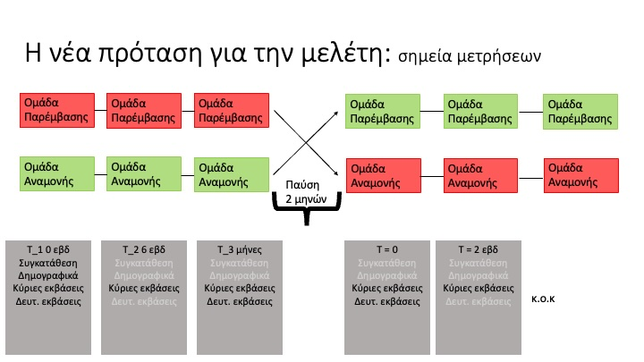
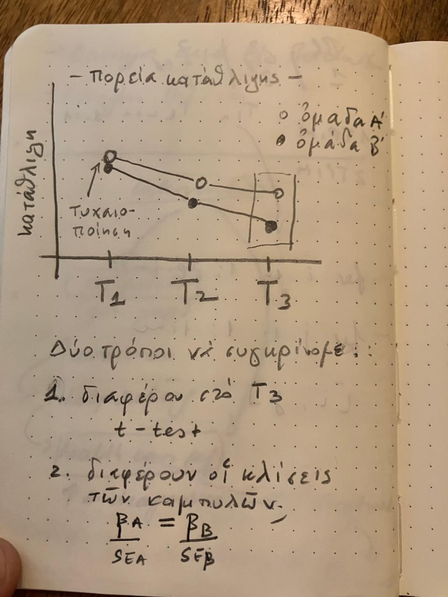

```{r echo = FALSE, warning = FALSE, message=FALSE}
#import data
library(readxl)
# received from Ms Katasafadou and Ms Theodoridou on 11th July 2023 an excel archive termed Q_EXTRACT_09.07.2024.xlsx, stored locally as
# "~/Downloads/Q_EXTRACT_09.07.2024.xlsx" and then moved here
# Note: there are fewer missing data than in the early preliminary analysis that I had sent around. Spoke with Ms Theodoridou, her team was very assiduous in chasing therapists to ensure completion. 
#
#qs_pol_syn <- read_excel("qs_pol_syn.xlsx")
#View(qs_pol_syn)

#received an updated dataset from Ms Katsafadou (in my UOA email cc Theodoridou and Stefanis)
## due to some errors that the database contained--see emails. 

#qs_pol_syn <- read_excel("~/Downloads/extract_16.07.2024.xlsx")

#received another update from Ms Katsafadou on 25th July 2024 

qs_pol_syn <- read_excel("~/Downloads/Extract_Q_Ενηλίκων_25.7.xlsx", 
     sheet = "Sheet 1 - Extract_Q_Ενηλίκων_2", 
     skip = 1)
 
```





```{r}

library(dplyr)

qs_pol_syn <- 
 qs_pol_syn %>% 
rename(
"art_site" = "ΦΟΡΕΑΣ ΠΟΛΙΤΙΣΜΟΥ",
"art_type" = "ΚΑΤΗΓΟΡΙΑ ΤΕΧΝΗΣ",
"pt_id" = "ΤΑΥΤΟΤΗΤΑ ΑΣΘΕΝΟΥΣ",
"gender" = "ΦΥΛΟ", 
"country_origin" = "ΧΩΡΑ", 
"patient_group" = "ΤΡΙΜΗΝΟ ΑΣΘΕΝΗ", 
"diagnosis" = "ΔΙΑΓΝΩΣΗ", 
"year_birth" = "ΕΤΟΣ ΓΕΝΝΗΣΗΣ", 
"performances" = "ΠΑΡΑΣΤΑΣΕΙΣ", 
"performances_sessions" = "ΠΑΡΑΣΤΑΣΕΙΣ /ΣΥΝΕΔΡΙΕΣ", 
"sessions" = "ΣΥΝΕΔΡΙΕΣ", 
"present_at_session" = "ΠΑΡΟΥΣΙΕΣ ΣΥΝΕΔΡΙΕΣ", 
"present_performance_session" = "ΠΑΡΟΥΣΙΕΣ ΠΑΡΑΣΤΑΣΕΙΣ/ΣΥΝΕΔΡΙΕΣ",
"present_performance" = "ΠΑΡΟΥΣΙΕΣ ΠΑΡΑΣΤΑΣΕΙΣ", 
"absent_sessions" = "ΑΠΟΥΣΙΕΣ ΣΥΝΕΔΡΙΕΣ", 
"absent_performances_sessions" = "ΑΠΟΥΣΙΕΣ ΠΑΡΑΣΤΑΣΕΙΣ/ΣΥΝΕΔΡΙΕΣ",
"absent_performance" = "ΑΠΟΥΣΙΕΣ ΠΑΡΑΣΤΑΣΕΙΣ",
"pending_presences" = "ΕΚΚΡΕΜΕΙ Η ΣΥΜΠΛΗΡΩΣΗ ΠΑΡΟΥΣΙΩΝ",
"randomised" = "ΤΥΧΑΙΟΠΟΙΗΘΗΚΕ",
"left_study_date"  = "Ημερομηνία Αποχώρησης", 
"place_residence" = "AT 1/34", 
"live_with_others" = "AT 2/34",
"educ_level" = "AT 3/34",
"family_status" = "AT 4/34",
"have_children" = "AT 5/34",
"employment_status" = "AT 6/34",
"other_employment_status" = "AT 7/34",
"employment_type" = "AT 8/34",
"annual_income" = "AT 9/34",
"phys_health_problems" = "AT 10/34",
"other_phys_health_problems" = "AT 11/34",
"art_visits_last_2y" = "AT 12/34",
"museum_visits" = "AT 13/34", 
"music_visits" = "AT 14/34", 
"theatre_visits" = "AT 15/34", 
"dance_visits" = "AT 16/34", 
"cinema_visits" = "AT 17/34", 
"literary_visits" = "AT 18/34",
"past_arts_involvement" = "AT 19/34",
"visual_involvement" = "AT 20/34",
"music_involvement" = "AT 21/34",
"theatre_involvement" = "AT 22/34",
"dance_involvement" = "AT 23/34",
"cinema_involvement" = "AT 24/34",
"photo_involvement" = "AT 25/34",
"literary_involvement" = "AT 26/34",
"other_involvement" = "AT 27/34",
"past_therapy_experience" = "AT 28/34",
"type_therapy_experience" = "AT 29/34",
"recent_therapy" = "AT 30/34",
"type_recent_therapy" = "AT 31/34",
"current_therapy" = "AT 32/34",
"type_current_therapy" = "AT 33/34",
"total_length_therapy" = "AT 34/34"
)


qs_pol_syn

```

```{r}
# recode gender and age
qs_pol_syn <- 
  qs_pol_syn %>% 
mutate(gender = recode (gender,
"ΑΡΡΕΝ" = "male",
"ΘΗΛΥ" = "female",
"ΑΛΛΟ" = "other"
))

# age
qs_pol_syn$age_intake <- 2024 - qs_pol_syn$year_birth


# recode randomised variable
qs_pol_syn$randomised = as.factor(qs_pol_syn$randomised)
qs_pol_syn <- 
  qs_pol_syn %>% 
mutate(randomised = recode (randomised,
"ΝΑΙ" = "yes",
"ΟΧΙ" = "no"
))

 
# exclude under 18 and those not randomised
qs_pol_syn <- qs_pol_syn %>% 
  filter(age_intake>18 & randomised == "yes")


### note communciation between Eleni Theodoridou, Nikos STefanis, Vicky Efthymiou and myself on email this morning 31st July 2024. The randomised people are 382. I am going to be working on them now. 


```

## Number of Participants

```{r echo = FALSE, warning = FALSE, message=FALSE}
# excluded participants who had not been randomised or minors as per variable in the dataset indicated in the email that was sent to me by Ms Katasafadou

print(paste("Our total number of participants is", length(unique(qs_pol_syn$pt_id ))))


```

## Which Group

As I understand it, people are allocated to a trimester, that is, randomised to either the first or second trimester. This how many people we have per trimester

```{r echo = FALSE, warning = FALSE, message=FALSE}

qs_pol_syn <- 
  qs_pol_syn %>% 
mutate(randomised = recode (randomised,
"ΝΑΙ" = "yes",
"ΟΧΙ" = "no"
))


qs_pol_syn$patient_group <- as.factor(qs_pol_syn$patient_group)
qs_pol_syn <-qs_pol_syn %>% 
   mutate(patient_group = recode(patient_group,
                                 "1ο Τρίμηνο" = "active", 
                                 "2ο Τρίμηνο" = "waitlist"))

 knitr::kable(table(qs_pol_syn$patient_group), col.names =  c("trimester", "n"))
```

## Gender Distribution

As shown in the table below, the majority are women

```{r echo = FALSE, message = FALSE, message=FALSE}

knitr:: kable(round(proportions(table(qs_pol_syn$gender))*100,1), col.names = c("gender", "%"))

```

Here you can also see that the distribution is quite smooth across the two trimesters, i.e. the randomisation seems to work

```{r echo = FALSE, warning = FALSE, message=FALSE}

tabulate_func <- function(x){
  
  round(proportions(table(x))*100,1)
  
}

tapply(qs_pol_syn$gender, qs_pol_syn$patient_group, tabulate_func)


```

## Age Distribution

\`

```{r echo = FALSE, message = FALSE, message=FALSE}
print(paste("The mean age is", mean(qs_pol_syn$age_intake, na.rm = TRUE), "(sd = ", round(sd(qs_pol_syn$age_intake, na.rm = TRUE),2), ")"))
hist(qs_pol_syn$age_intake)
```

Here you can also see that the ages are very similar across the two trimester groups, i.e. our randomised groups

```{r echo = FALSE, warning = FALSE, message=FALSE}
rbind(
  mean = tapply(qs_pol_syn$age_intake, qs_pol_syn$patient_group, mean, na.rm = T),
sd = tapply(qs_pol_syn$age_intake, qs_pol_syn$patient_group, sd, na.rm = T)
)

```

## Art Sites

This is were the treatment is taking place

```{r echo = FALSE, message = FALSE, message=FALSE}
#table(qs_pol_syn$`ΚΑΤΗΓΟΡΙΑ ΤΕΧΝΗΣ`)
knitr:: kable(round(proportions(table(qs_pol_syn$art_site))*100, 2), col.names = 
                c("art site", "%"))
```

## Diagnoses

We will need to condense some diagnostic categories. Let's discuss how best to do.

```{r echo = FALSE, message = FALSE, message=FALSE}
round(proportions(table(qs_pol_syn$diagnosis))*100, 2)
```

## Anxiety as measured by the GAD-7

The GAD-7 scores are well-behaved but we are missing about a third of them, as you can see below.

We have most of the missing values in the 2nd trimester which is worrying.

```{r}
gad_labels <- paste0("gad_", 1:7)

gad_vars <- expand.grid(gad_labels, c("_t1", "_t2", "_t3"))

gad_vars <- paste0(gad_vars$Var1, gad_vars$Var2)

qs_pol_syn <- 
 qs_pol_syn %>% 
rename(
"gad_1_t1" = "T1/1",
"gad_2_t1" = "T1/2", 
"gad_3_t1" = "T1/3", 
"gad_4_t1" = "T1/4", 
"gad_5_t1" = "T1/5", 
"gad_6_t1"  = "T1/6", 
"gad_7_t1"  = "T1/7", 

"gad_1_t2" = "T2/1",
"gad_2_t2" = "T2/2", 
"gad_3_t2" = "T2/3", 
"gad_4_t2" = "T2/4", 
"gad_5_t2" = "T2/5", 
"gad_6_t2"  = "T2/6", 
"gad_7_t2"  = "T2/7", 

"gad_1_t3" = "T3/1",
"gad_2_t3" = "T3/2", 
"gad_3_t3" = "T3/3", 
"gad_4_t3" = "T3/4", 
"gad_5_t3" = "T3/5", 
"gad_6_t3"  = "T3/6", 
"gad_7_t3"  = "T3/7"  
)


recode_fun <- function(x) {
  recode(x, "ΚΑΘΟΛΟΥ" = 0, 
             "ΜΕΡΙΚΕΣ ΜΕΡΕΣ" = 1, 
             "ΠΕΡΙΣΣΟΤΕΡΕΣ ΑΠΟ ΤΙΣ ΜΙΣΕΣ ΜΕΡΕΣ" = 2, 
             "ΣΧΕΔΟΝ ΚΑΘΕ ΜΕΡΑ" = 3, 
             .default = NA_real_, 
             .missing = NA_real_)
}


qs_pol_syn <- qs_pol_syn %>%
  mutate_at(vars(starts_with("gad_")), recode_fun)   


### create sum scores
qs_pol_syn <- qs_pol_syn %>%
  rowwise() %>%
  mutate(gad_total_score_1 = if_else(any(is.na(c_across(starts_with("gad_") & ends_with("_t1")))), NA_real_, sum(c_across(starts_with("gad_") & ends_with("_t1")))),
         gad_total_score_2 = if_else(any(is.na(c_across(starts_with("gad_") & ends_with("_t2")))), NA_real_, sum(c_across(starts_with("gad_") & ends_with("_t2")))),
         gad_total_score_3 = if_else(any(is.na(c_across(starts_with("gad_") & ends_with("_t3")))), NA_real_, sum(c_across(starts_with("gad_") & ends_with("_t3"))))) %>%
  ungroup()


```

```{r}
phq_labels <- paste0("phq_", 1:9)

phq_vars <- expand.grid(phq_labels, c("_t1", "_t2", "_t3"))

phq_vars <- paste0(phq_vars$Var1, phq_vars$Var2)

qs_pol_syn <- 
 qs_pol_syn %>% 
rename(
  
"phq_1_t1" = "T1/9",
"phq_2_t1" = "T1/10", 
"phq_3_t1" = "T1/11", 
"phq_4_t1" = "T1/12", 
"phq_5_t1" = "T1/13", 
"phq_6_t1" = "T1/14", 
"phq_7_t1" = "T1/15",
"phq_8_t1" = "T1/16",
"phq_9_t1" = "T1/17",

"phq_1_t2" = "T2/9",
"phq_2_t2" = "T2/10", 
"phq_3_t2" = "T2/11", 
"phq_4_t2" = "T2/12", 
"phq_5_t2" = "T2/13", 
"phq_6_t2" = "T2/14", 
"phq_7_t2" = "T2/15",
"phq_8_t2" = "T2/16",
"phq_9_t2" = "T2/17",

"phq_1_t3" = "T3/9",
"phq_2_t3" = "T3/10", 
"phq_3_t3" = "T3/11", 
"phq_4_t3" = "T3/12", 
"phq_5_t3" = "T3/13", 
"phq_6_t3" = "T3/14", 
"phq_7_t3" = "T3/15",
"phq_8_t3" = "T3/16",
"phq_9_t3" = "T3/17"
    

)


recode_fun <- function(x) {
  recode(x, "ΚΑΘΟΛΟΥ" = 0, 
             "ΜΕΡΙΚΕΣ ΜΕΡΕΣ" = 1, 
             "ΠΕΡΙΣΣΟΤΕΡΕΣ ΑΠΟ ΤΙΣ ΜΙΣΕΣ ΜΕΡΕΣ" = 2, 
             "ΣΧΕΔΟΝ ΚΑΘΕ ΜΕΡΑ" = 3, 
             .default = NA_real_, 
             .missing = NA_real_)
}


qs_pol_syn <- qs_pol_syn %>%
  mutate_at(vars(starts_with("phq_")), recode_fun)   


### create sum scores
qs_pol_syn <- qs_pol_syn %>%
  rowwise() %>%
  mutate(phq_total_score_1 = if_else(any(is.na(c_across(starts_with("phq_") & ends_with("_t1")))), NA_real_, sum(c_across(starts_with("phq_") & ends_with("_t1")))),
         phq_total_score_2 = if_else(any(is.na(c_across(starts_with("phq_") & ends_with("_t2")))), NA_real_, sum(c_across(starts_with("phq_") & ends_with("_t2")))),
         phq_total_score_3 = if_else(any(is.na(c_across(starts_with("phq_") & ends_with("_t3")))), NA_real_, sum(c_across(starts_with("phq_") & ends_with("_t3"))))) %>%
  ungroup()


```

## Wellbeing and loneliness

```{r}


qs_pol_syn <- 
 qs_pol_syn %>% 
rename(
  
"WEMWBS_1_t1" =  "T1/19",
"WEMWBS_2_t1" =  "T1/20",
"WEMWBS_3_t1 "=  "T1/21",
"WEMWBS_4_t1" =  "T1/22",
"WEMWBS_5_t1" =  "T1/23",
"WEMWBS_6_t1" =  "T1/24",
"WEMWBS_7_t1" =  "T1/25",
"WEMWBS_8_t1" =  "T1/26",
"WEMWBS_9_t1" =  "T1/27",
"WEMWBS_10_t1" =  "T1/28",
"WEMWBS_11_t1" =  "T1/29",
"WEMWBS_12_t1" =  "T1/30",
"WEMWBS_13_t1" =  "T1/31",
"WEMWBS_14_t1" =  "T1/32",
"LONEL_1_t1" =  "T1/33",
"LONEL_2_t1" =  "T1/34",
"LONEL_3_t1" =  "T1/35",

"WEMWBS_1_t2" =  "T2/19",
"WEMWBS_2_t2" =  "T2/20",
"WEMWBS_3_t2 "=  "T2/21",
"WEMWBS_4_t2" =  "T2/22",
"WEMWBS_5_t2" =  "T2/23",
"WEMWBS_6_t2" =  "T2/24",
"WEMWBS_7_t2" =  "T2/25",
"WEMWBS_8_t2" =  "T2/26",
"WEMWBS_9_t2" =  "T2/27",
"WEMWBS_10_t2" =  "T2/28",
"WEMWBS_11_t2" =  "T2/29",
"WEMWBS_12_t2" =  "T2/30",
"WEMWBS_13_t2" =  "T2/31",
"WEMWBS_14_t2" =  "T2/32",
"LONEL_1_t2" =  "T2/33",
"LONEL_2_t2" =  "T2/34",
"LONEL_3_t2" =  "T2/35",


"WEMWBS_1_t3" =  "T3/19",
"WEMWBS_2_t3" =  "T3/20",
"WEMWBS_3_t3 "=  "T3/21",
"WEMWBS_4_t3" =  "T3/22",
"WEMWBS_5_t3" =  "T3/23",
"WEMWBS_6_t3" =  "T3/24",
"WEMWBS_7_t3" =  "T3/25",
"WEMWBS_8_t3" =  "T3/26",
"WEMWBS_9_t3" =  "T3/27",
"WEMWBS_10_t3" =  "T3/28",
"WEMWBS_11_t3" =  "T3/29",
"WEMWBS_12_t3" =  "T3/30",
"WEMWBS_13_t3" =  "T3/31",
"WEMWBS_14_t3" =  "T3/32",
"LONEL_1_t3" =  "T3/33",
"LONEL_2_t3" =  "T3/34",
"LONEL_3_t3" =  "T3/35"

)


recode_fun_lonel <- function(x) {
  recode(x, 
             "ΣΧΕΔΟΝ ΠΟΤΕ" = 1, 
             "ΜΕΡΙΚΕΣ ΦΟΡΕΣ" = 2, 
             "ΣΥΧΝΑ" = 3, 
             .default = NA_real_, 
             .missing = NA_real_)
}


recode_fun_wembs <- function(x) {
  recode(x, "ΠΟΤΕ" = 1, 
             "ΣΠΑΝΙΑ" = 2, 
             "ΜΕΡΙΚΕΣ ΦΟΡΕΣ" = 3, 
             "ΣΥΧΝΑ" = 4, 
         "ΔΙΑΡΚΩΣ" = 5, 
             .default = NA_real_, 
             .missing = NA_real_)
}


qs_pol_syn <- qs_pol_syn %>%
  mutate_at(vars(starts_with("WEMWBS_")), recode_fun_wembs)   

qs_pol_syn <- qs_pol_syn %>%
  mutate_at(vars(starts_with("LONEL_")), recode_fun_lonel)  


### create sum scores
qs_pol_syn <- qs_pol_syn %>%
  rowwise() %>%
  mutate(wembs_total_score_1 = if_else(any(is.na(c_across(starts_with("WEMWBS_") & ends_with("_t1")))), NA_real_, sum(c_across(starts_with("WEMWBS_") & ends_with("_t1")))),
         wembs_total_score_2 = if_else(any(is.na(c_across(starts_with("WEMWBS_") & ends_with("_t2")))), NA_real_, sum(c_across(starts_with("WEMWBS_") & ends_with("_t2")))),
         wembs_total_score_3 = if_else(any(is.na(c_across(starts_with("WEMWBS_") & ends_with("_t3")))), NA_real_, sum(c_across(starts_with("WEMWBS_") & ends_with("_t3"))))) %>%
  ungroup()


qs_pol_syn <- qs_pol_syn %>%
  rowwise() %>%
  mutate(lonel_total_score_1 = if_else(any(is.na(c_across(starts_with("LONEL_") & ends_with("_t1")))), NA_real_, sum(c_across(starts_with("LONEL_") & ends_with("_t1")))),
         lonel_total_score_2 = if_else(any(is.na(c_across(starts_with("LONEL_") & ends_with("_t2")))), NA_real_, sum(c_across(starts_with("LONEL_") & ends_with("_t2")))),
         lonel_total_score_3 = if_else(any(is.na(c_across(starts_with("LONEL_") & ends_with("_t3")))), NA_real_, sum(c_across(starts_with("LONEL_") & ends_with("_t3"))))) %>%
  ungroup()

```

## Total number of people, missingness and descriptives for main questionnaires

```{r}
paste("The total number of people randomised is", nrow(qs_pol_syn))

df_questionnaires_descriptives <- qs_pol_syn %>% 
dplyr:: select(matches("total_score_\\d+$")
)

df_questionnaires_descriptives <- as.data.frame(df_questionnaires_descriptives)

n_missing <- 0 
perc_missing <- 0 
avg_qs <- 0
std_qs <- 0 

for(i in 1:ncol(df_questionnaires_descriptives)){
    
 n_missing[i]     <- sum(is.na(df_questionnaires_descriptives[, i]))
 
 perc_missing[i]  <- sum(is.na(df_questionnaires_descriptives[, i]))/(nrow(df_questionnaires_descriptives))
 
 avg_qs[i] <- mean(df_questionnaires_descriptives[, i], na.rm = T)
 
 
std_qs[i] <- sd(df_questionnaires_descriptives[, i], na.rm = T)

}


questionnaire_descriptives <- data.frame(cbind(questionnaires = colnames(df_questionnaires_descriptives),n_missing, perc_missing, avg_qs, std_qs))


```

```{r}
for(i in 1: ncol(df_questionnaires_descriptives)){
  
  
  hist(df_questionnaires_descriptives[,i],
  main = colnames(df_questionnaires_descriptives)[i], 
  xlab = colnames(df_questionnaires_descriptives)[i])
  
}
```

## Creating a long dataset for further analyses

```{r}

qs_pol_syn_for_long <- qs_pol_syn %>% 
dplyr:: select(matches("total_score_\\d+$"), matches("t\\d+$"), "pt_id", "art_site", "art_type", "gender", "patient_group", "diagnosis", "age_intake", 
"place_residence", "live_with_others"
)
# I have chosen these baseline variables as they are available for everybody at baseline and can be used for imputation as predictors

time_varying_pattern <- "(.*)_(\\d+)$"

#  dataframe to long format
qs_pol_syn_long <- qs_pol_syn_for_long %>%
 tidyr:: pivot_longer(
    cols = matches(time_varying_pattern),
    names_to = c(".value", "time_point"),
    names_pattern = time_varying_pattern
  ) %>%
  arrange(pt_id, time_point)

qs_pol_syn_long <- qs_pol_syn_long %>%
  mutate(time_point = paste("time_point", time_point, sep = "_"))

# check dimensions make sense
dimensions <- dim(qs_pol_syn_long)
dimensions[1] == 3*nrow(qs_pol_syn_for_long) # the number of rows in the long shoule be equal to the number of rows in the wide x the time points, i.e. *3


# check that scores make sense, e.g. that gad in the long and wide dfs are equal
qs_pol_syn_long %>%
  filter(time_point == "time_point_1") %>% 
  summarise(avg_gad = mean (gad_total_score, na.rm = T)) == mean(qs_pol_syn$gad_total_score_1, na.rm = T) 
# they do, the scores are equal as this example shows.
```

## Some more data wrangling

```{r}

# art site
qs_pol_syn_long <- 
  qs_pol_syn_long %>% 
mutate(art_site = recode (art_site,
"ΕΘΝΙΚΟ ΘΕΑΤΡΟ" = "nat_theatre",
"ΕΘΝΙΚΗ ΠΙΝΑΚΟΘΗΚΗ" = "nat_gallery",
"ΟΡΓΑΝΙΣΜΟΣ ΜΕΓΑΡΟΥ ΜΟΥΣΙΚΗΣ ΑΘΗΝΩΝ" = "music_hall_athens",
"ΦΕΣΤΙΒΑΛ ΚΙΝΗΜΑΤΟΓΡΑΦΟΥ ΘΕΣΣΑΛΟΝΙΚΗΣ" = "cinema_festival_thessaloniki",
"ΕΘΝΙΚΗ ΛΥΡΙΚΗ ΣΚΗΝΗ" = "national_opera",
"ΚΡΑΤΙΚΟ ΘΕΑΤΡΟ ΒΟΡΕΙΟΥ ΕΛΛΑΔΟΣ" = "state_theatre_north",
"MOMUS - ΜΟΥΣΕΙΟ ΆΛΕΞ ΜΥΛΩΝΑ" = "momus_museum",
"ΟΡΓΑΝΙΣΜΟΣ ΜΕΓΑΡΟΥ ΜΟΥΣΙΚΗΣ ΘΕΣΣΑΛΟΝΙΚΗΣ" = "music_hall_thessaloniki",
"ΕΘΝΙΚΟ ΜΟΥΣΕΙΟ ΣΥΓΧΡΟΝΗΣ ΤΕΧΝΗΣ" = "nat_modern_art_museum_mylonas",
"MOMUS ΜΟΥΣΕΙΟ ΣΥΓΧΡΟΝΗΣ ΤΕΧΝΗΣ" = "momus_museum_art_contemp",
"ΚΡΑΤΙΚΗ ΣΧΟΛΗ ΟΡΧΗΣΤΙΚΗΣ ΤΕΧΝΗΣ" = "state_school_orchestra",
"MOMUS - ΜΟΥΣΕΙΟ ΦΩΤΟΓΡΑΦΙΑΣ" = "momus_museum_photo"

))
unique(qs_pol_syn_long$art_site)

# art type
qs_pol_syn_long <- 
  qs_pol_syn_long %>% 
mutate(art_type = recode (art_type,
"Α1. ΕΡΓΑΣΤΗΡΙ ΘΕΑΤΡΟΥ" = "A1",
"Β2. ΕΡΓΑΣΤΗΡΙ ΤΕΧΝΗΣ ΜΕ ΕΦΑΡΜΟΓΕΣ ΕΙΚΑΣΤΙΚΗΣ ΘΕΡΑΠΕΙΑΣ ΣΕ ΠΙΝΑΚΟΘΗΚΗ" = "B2",
"Ε8. TICKET SET/ ΕΙΣΙΤΗΡΙΑ ΓΙΑ ΜΟΥΣΙΚΕΣ ΠΑΡΑΣΤΑΣΕΙΣ - minimum 3/τρίμηνο" = "E8",
"Δ1. ΘΕΡΑΠΕΥΤΙΚΟ ΕΡΓΑΣΤΗΡΙ ΠΡΟΒΟΛΗΣ ΤΑΙΝΙΩΝ" = "D1",
"Ε5. ΕΡΓΑΣΤΗΡΙ ΜΟΥΣΙΚΟΘΕΡΑΠΕΙΣ" = "E5",
"Α8. TICKET SET/  ΕΙΣΙΗΤΡΙΑ ΓΙΑ ΠΑΡΑΣΤΑΣΕΙΣ ΘΕΑΤΡΟΥ - minimum 3/τρίμηνο" = "A8",
"Β1. ΕΡΓΑΣΤΗΡΙ ΤΕΧΝΗΣ ΕΦΑΡΜΟΓΩΝ ΕΙΚΑΣΤΙΚΗΣ ΘΕΡΑΠΕΙΑΣ ΣΕ ΜΟΥΣΕΙΟ" = "B1",
"Ε6. ΘΕΡΑΠΕΥΤΙΚΟ ΕΡΓΑΣΤΗΡΙ ΧΟΡΩΔΙΑΣ" = "E6",
"Ε3. ΘΕΡΑΠΕΥΤΙΚΟ ΜΟΥΣΙΚΟΘΕΡΑΠΕΥΤΙΚΟ ΕΡΓΑΣΤΗΡΙ" = "E3",
"Γ1. ΘΕΡΑΠΕΥΤΙΚΟ ΕΡΓΑΣΤΗΡΙ ΧΟΡΟΥ" = "C1",
"Β5. ΘΕΡΑΠΕΥΤΙΚΟ ΕΡΓΑΣΤΗΡΙ ΦΩΤΟΓΡΑΦΙΑΣ ΣΕ ΜΟΥΣΕΙΟ" = "B5"

))

unique(qs_pol_syn_long$art_type)

#diagnosis
qs_pol_syn_long <- qs_pol_syn_long %>%
  mutate(diagnosis = sub("([F]\\d+).*", "\\1", diagnosis))

# make sure right
unique(qs_pol_syn_long$diagnosis)


#place residence
qs_pol_syn_long <- 
  qs_pol_syn_long %>% 
mutate(place_residence = recode (place_residence,
"Μεγάλη Πόλη (>500.0000 Κάτοικοι)" = "big_city_over_500K",
"Κωμόπολη (2.000-10.000 Κάτοικοι)" = "town_btw_2K_10K",
"Πόλη (10.001-500.000 Κάτοικοι)" = "city_btw_10K_500K",
"Χωριό (<2.000 Κάτοικοι)" = "village_below_2K"

))
unique(qs_pol_syn_long$place_residence)


# live_with_others


qs_pol_syn_long <- 
  qs_pol_syn_long %>% 
mutate(live_with_others = recode (live_with_others,
"Με άλλους" = "with_others",
"Με οικογένεια" = "with_family",
"Μόνος/η/ο" = "alone"

))

unique(qs_pol_syn_long$live_with_others)


qs_pol_syn_long$live_with_others <- as.factor(qs_pol_syn_long$live_with_others) 
qs_pol_syn_long$place_residence <- as.factor(qs_pol_syn_long$place_residence)
qs_pol_syn_long$diagnosis <- as.factor(qs_pol_syn_long$diagnosis)
qs_pol_syn_long$art_type <- as.factor(qs_pol_syn_long$art_type)
qs_pol_syn_long$art_site <- as.factor(qs_pol_syn_long$art_site)
qs_pol_syn_long$gender <- as.factor(qs_pol_syn_long$gender)
qs_pol_syn_long$time_point <- as.factor(qs_pol_syn_long$time_point)
qs_pol_syn_long$patient_group <- as.factor(qs_pol_syn_long$patient_group)
```

## check missingness

```{r}
library(naniar)
vis_miss(qs_pol_syn_long)
gg_miss_upset(qs_pol_syn_long)

### Looking at what predicts missingness
missing_model <- glm(is.na(phq_total_score) ~ time_point + patient_group+ gender + age_intake, family = binomial, data = qs_pol_syn_long)
summary(missing_model)
# it does not seem to be related to patient group at all, but is with age
```

## Plot outcomes

```{r}

# first create the summary stats (done above, but repeating here from long)
# the outcome variables
outcome_vars <- c("phq_total_score", "gad_total_score", "wembs_total_score")


scores_over_time <- list()

# Loop through the outcome variables
for (i in outcome_vars) {
  # Dynamically filter, group, and summarize the data using [[ operator
  scores_over_time[[i]] <- qs_pol_syn_long %>%
    #filter(!is.na(.data[[i]])) %>%
    group_by(time_point, patient_group) %>%
    summarise(
      n = n(),
      avg = mean(.data[[i]], na.rm = TRUE),
      std = sd(.data[[i]], na.rm = TRUE),
      missing = sum(is.na(.data[[i]])),
      .groups = 'drop'  # To avoid a warning about `summarise` using grouping
    ) %>%
    mutate(se = std / sqrt(n))  # Calculate standard error
}


scores_over_time


####IMPORTANT: NOTE THAT WE DO HAVE DIFFERENTIAL ATTRITION AT BASELINE with more people missing for the waitlist group.

library(ggplot2)
#plots for missingness
plots_missing_data_over_time <- list()
for (i in outcome_vars) {
plots_miss[[i]] <- scores_over_time[[i]] %>% 
    ggplot(aes(time_point, missing, fill = patient_group)) +
             geom_col()+
  ggtitle(names(scores_over_time[i]))

  
}
plots_missing_data_over_time
# plot attrition over time

# plots for distributions
plots_distributions_over_time <- list()
for (i in outcome_vars) {
plots_distributions_over_time[[i]] <- qs_pol_syn_long %>% 
  ggplot(aes(patient_group, .data[[i]], fill = patient_group))+
  geom_violin(alpha = 0.5) +
  geom_dotplot(binaxis = "y",
               stackdir = "center",
               dotsize = 0.5)+
  ggtitle(names(qs_pol_syn_long[i]))+
  facet_wrap(~time_point)
}
plots_distributions_over_time


# line plots
plots_scores_over_time <- list()
for(i in outcome_vars){
plots_scores_over_time[[i]] <- scores_over_time[[i]] %>% 
  ggplot(aes(time_point, avg, group = patient_group, colour =patient_group ))+
  geom_errorbar(aes(ymin=avg-se, ymax=avg+se), width=.1, 
    position=position_dodge(0.05))+
  geom_line()+
geom_point()+
   scale_color_brewer(palette="Paired")+theme_minimal()+
  ggtitle(names(scores_over_time[i]))+
  ylab("Mean Score (+/- SE)")+
  theme_minimal()
}
plots_scores_over_time
```

### Run LME

```{r}
library(lme4)
library(lmerTest)
# change pt_id to factor
qs_pol_syn_long$pt_id <- as.factor(qs_pol_syn_long$pt_id)

outcome_vars <- c("phq_total_score", "gad_total_score", "wembs_total_score")


lme_intercept_models <- list()
lme_intercept_models_summaries <- list()
for(i in outcome_vars){
formula_intercept <- as.formula(paste(i, "~ time_point * patient_group + (1 | pt_id)"))
lme_intercept_models[[i]] <- lmer(formula_intercept,  data = qs_pol_syn_long)
lme_intercept_models_summaries[[i]] <- summary(lme_intercept_models[[i]])
#names(lme_intercept_models) <- outcome_vars
}

# check models
lme_intercept_models_summaries


### here is the model for random slopes
# it does not converge unfortunately.
lme_intercept_slope <- lmer(phq_total_score ~ time_point*patient_group + (0+ time_point|pt_id),  data = qs_pol_syn_long)
summary(lme_intercept_slope)

```

## Run LME with time as continuous and covariates

```{r}
library(lme4)
library(lmerTest)
# change pt_id to factor
qs_pol_syn_long$pt_id <- as.factor(qs_pol_syn_long$pt_id)

# specify time variable as continuous 
qs_pol_syn_long$time <- as.integer(qs_pol_syn_long$time_point)

outcome_vars <- c("phq_total_score", "gad_total_score", "wembs_total_score")


lme_intercept_models_cont <- list()
lme_intercept_models_summaries_cont <- list()
for(i in outcome_vars){
formula_intercept_cont <- as.formula(paste(i, "~ time * patient_group + 
                                           gender + age_intake +
                                           art_type +
                                           diagnosis +
                                        place_residence+
                                        live_with_others+
                                           (1 | pt_id)"))
lme_intercept_models_cont[[i]] <- lmer(formula_intercept_cont,  data = qs_pol_syn_long)
lme_intercept_models_summaries_cont[[i]] <- summary(lme_intercept_models_cont[[i]])
#names(lme_intercept_models) <- outcome_vars
}

# check models
lme_intercept_models_summaries_cont


```

## Multiple imputation

### Preparation of variables for MI

```{r}
# create smaller dataset
# I am leaving out diagnosis as we have too few and it will be difficult for the 
# imp to cope with
# I am also only using time art type and not site as they are collinear
qs_pol_syn_long_for_imp <- qs_pol_syn_long %>%
  dplyr:: select(
"pt_id", "art_type", "gender", "patient_group", 
"place_residence", "live_with_others", "phq_total_score", "gad_total_score", 
"wembs_total_score", "time", "age_intake"
)


# also need to turn pt id to integer
 pt_id_mapping <- qs_pol_syn_long_for_imp %>%
   select(pt_id) %>%
   distinct() %>%
   mutate(pt_id_int = row_number())# 
 qs_pol_syn_long_for_imp <- qs_pol_syn_long_for_imp %>%
   left_join(pt_id_mapping, by = "pt_id") %>%
  select(-pt_id) %>%
  rename(pt_id = pt_id_int)

class(qs_pol_syn_long_for_imp$pt_id)
```

## MI model with random intercept and constraints on min and max values

```{r}
library(mice)
library(dplyr)

# Define the custom imputation function with bounds for 2l.norm
bounded_2l_norm <- function(y, ry, x, type, lower_bound, upper_bound, ...) {
  imputed_values <- mice.impute.2l.norm(y, ry, x, type, ...)
  imputed_values <- pmin(pmax(imputed_values, lower_bound), upper_bound)
  return(imputed_values)
}

# Define specific custom functions for each outcome variable
mice.impute.bounded_2l_norm_phq <- function(y, ry, x, type, ...) bounded_2l_norm(y, ry, x, type, 0, 27, ...)
mice.impute.bounded_2l_norm_gad <- function(y, ry, x, type, ...) bounded_2l_norm(y, ry, x, type, 0, 21, ...)
mice.impute.bounded_2l_norm_wembs <- function(y, ry, x, type, ...) bounded_2l_norm(y, ry, x, type, 14, 70, ...)

# Define the predictors
predictors <- c("art_type", "gender", "patient_group",  
                "place_residence", "live_with_others", "age_intake", 
                "time_point")

# Check that all predictors are in the dataframe
valid_predictors <- predictors[predictors %in% colnames(qs_pol_syn_long_for_imp)]

# Create a predictor matrix
pred_matrix <- make.predictorMatrix(qs_pol_syn_long_for_imp)

# Specify which variables should be used as predictors for each other variable
pred_matrix[, "pt_id"] <- -2 # Specify 'pt_id' as the grouping (cluster) variable for multilevel imputation
pred_matrix["pt_id", ] <- 0  # Ensure 'pt_id' is not used to predict other variables

# Ensure all valid predictors are used to predict the outcome variables
for (var in valid_predictors) {
  pred_matrix[, var] <- 1
  pred_matrix[var, ] <- 1
}

# Ensure 'pt_id' is not imputed
pred_matrix["pt_id", ] <- 0

# Specify methods for imputation
methods <- make.method(qs_pol_syn_long_for_imp)

# Specify the custom imputation method for each outcome variable
methods["phq_total_score"] <- "bounded_2l_norm_phq"
methods["gad_total_score"] <- "bounded_2l_norm_gad"
methods["wembs_total_score"] <- "bounded_2l_norm_wembs"

# Run the multiple imputation with custom method
imputed_data <- mice(
  qs_pol_syn_long_for_imp, 
  m = 25, 
  maxit = 25, 
  method = methods, 
  predictorMatrix = pred_matrix, 
  seed = 1974 
)


```

## Check imputation quality

```{r}
imputed_datasets <- complete(imputed_data, "all")
sum(is.na(imputed_datasets[[1]]$phq_total_score))
range(imputed_datasets[[1]]$phq_total_score)

# Check the imputed data
summary(imputed_data)

# Trace plots to check convergence
plot(imputed_data)

# Density plots to compare observed and imputed values
#densityplot(imputed_data, ~ phq_total_score + gad_total_score + wembs_total_score)

# Descriptive statistics for observed and imputed values
observed_data <- qs_pol_syn_long_for_imp[complete.cases(qs_pol_syn_long_for_imp), ]
imputed_data_long <- complete(imputed_data, action = "long")
observed_summary <- summary(observed_data)
imputed_summary <- summary(imputed_data_long)

print("Observed Data Summary")
print(observed_summary)
print("Imputed Data Summary")
print(imputed_summary)

# Scatter plot of observed vs imputed values
stripplot(imputed_data, pch = 20, cex = 1.2)


# XY plots for imputed vs observed values
mice::xyplot(imputed_data, phq_total_score ~ gad_total_score | .imp, pch = 20, cex = 1.2)


summary(complete(imputed_data, action = "long"))

stripplot(imputed_data, pch = 20, cex = 1.2)

```

## LME model for imputed data

```{r}
library(mice)
library(lme4)
library(broom.mixed)  # For tidying model output

# Define the outcome variables
outcome_vars <- c("phq_total_score", "gad_total_score", "wembs_total_score")

# Initialize lists to store models and their summaries
lme_intercept_models_cont <- list()
lme_intercept_models_summaries_cont <- list()
p_values <- 0

# Extract each imputed dataset
imputed_datasets_list <- complete(imputed_data, "all")

# Fit and pool the models for each outcome variable
for (i in outcome_vars) {
  models <- list()
  
  formula_intercept_cont <- as.formula(paste(i, "~ time * patient_group + 
                                             gender + age_intake +
                                             art_type +
                                             place_residence +
                                             live_with_others +
                                             (1 | pt_id)"))
  
  for (j in seq_along(imputed_datasets_list)) {
    # Fit the model on the j-th imputed dataset
    models[[j]] <- lmer(formula_intercept_cont, data = imputed_datasets_list[[j]])
  }
  
  # Pool the results
  pooled <- pool(models)
  
  # Store the pooled summary
  lme_intercept_models_cont[[i]] <- models
  lme_intercept_models_summaries_cont[[i]] <- summary(pooled)
 # p_values[i] <- lme_intercept_models_summaries_cont[[i]]$p.value
}


```

## Bayesian model with imputed data

```{r}

custom_priors <- c(
  set_prior("normal(0, 10)", class = "b"),  # Population-level effects
  set_prior("cauchy(0, 2)", class = "sd"),  # Group-level SD
  set_prior("student_t(3, 0, 2.5)", class = "sigma") # Residual standard deviation
)


brm(phq_total_score~ time * patient_group + 
                                             gender + age_intake +
                                             art_type +
                                             place_residence +
                                             live_with_others +
                                             (1+ time | pt_id), data =  imputed_datasets_list[[1]],,
   prior = custom_priors,
   chains = 4, cores = 4, iter = 15000,
   control = list(adapt_delta = 0.999, max_treedepth = 20)
                                             )
                                             
```

```{r}
custom_priors <- c(
  set_prior("normal(0, 10)", class = "b"),  # Population-level effects
  set_prior("cauchy(0, 2)", class = "sd"),  # Group-level SD
  set_prior("student_t(3, 0, 2.5)", class = "sigma") # Residual standard deviation
)

# Fit and pool the models for each outcome variable
for (i in outcome_vars) {
models_formula_int_and_slope_cont <- list()
  
  formula_int_and_slope_cont <- as.formula(paste(i, "~ time * patient_group + 
                                             gender + age_intake +
                                             art_type +
                                             place_residence +
                                             live_with_others +
                                             (1+ time | pt_id)"))
  
  for (j in seq_along(imputed_datasets_list)) {
    # Fit the model on the j-th imputed dataset
    models_formula_int_and_slope_cont[[j]] <- brm(formula_int_and_slope_cont, data = imputed_datasets_list[[j]], 
                       ,
  family = gaussian(),
  prior = custom_priors,
  chains = 4, cores = 4, iter = 10000,
  control = list(adapt_delta = 0.99, max_treedepth = 15))
  }

}


# Summary of the model
# summary(brms_model_phq_imp)
# broom.mixed:: tidy(brms_model_phq_imp)
# 
# # Plot the results
# plot(brms_model_phq_imp)
```

\############################### UP TO HERE \###################

```{r echo = FALSE, message = FALSE, message=FALSE}
gad_labels <- paste0("gad_", 1:7) 

gad_vars <- expand.grid(gad_labels, c("_t1", "_t2", "_t3"))

gad_vars <- paste0(gad_vars$Var1, gad_vars$Var2)


recode_fun <- function(x) {
  recode(x, "ΚΑΘΟΛΟΥ" = 0, 
             "ΜΕΡΙΚΕΣ ΜΕΡΕΣ" = 1, 
             "ΠΕΡΙΣΣΟΤΕΡΕΣ ΑΠΟ ΤΙΣ ΜΙΣΕΣ ΜΕΡΕΣ" = 2, 
             "ΣΧΕΔΟΝ ΚΑΘΕ ΜΕΡΑ" = 3, 
             .default = NA_real_, 
             .missing = NA_real_)
}


qs_pol_syn <- qs_pol_syn %>%
  mutate_at(vars(starts_with("gad_")), recode_fun)   


gad_df_1$gad_total_score_1 <- rowSums(gad_df_1)

print(paste("We are missing n = ", sum(is.na(gad_df_1$gad_total_score_1)), "out of", 
            length(gad_df_1$gad_total_score_1), "which amounts to ", round(sum(is.na(gad_df_1$gad_total_score_1))/length(gad_df_1$gad_total_score_1)*100, 1),
            "%"))

find_missing <- function(x){
  (sum(is.na(x))/length(x))*100
}

print("Here are the relative proportions of people missing GAD-7 per trimester allocation")
tapply(gad_df_1$gad_total_score_1,qs_pol_syn$`ΤΡΙΜΗΝΟ ΑΣΘΕΝΗ`, find_missing )


hist(gad_df_1$gad_total_score_1,  main = "GAD-7 total score distribution Time 1", xlab ="GAD-7 score")


gad_cutoffs <- c(0, 4, 9, 14, 15)
labels_gad_cutoffs <- c("minimal anxiety", "mild anxiety", "moderate anxiety", "severe severe")
gad_df_1$gad_category_1 <- cut(gad_df_1$gad_total_score_1, breaks = gad_cutoffs, labels = labels_gad_cutoffs)
props_cat_gad_7_1 <- data.frame(round(proportions(table(gad_df_1$gad_category_1))*100, 2))

props_cat_gad_7 %>% 
  ggplot(aes(x = Var1, y = Freq))+
  geom_col()+
  xlab("Severity Level")+
  ylab("Percentage")+
  ggtitle("Anxiety Severity Time 1")

```

```{r}
gad_labels <- paste0("gad_", 1:7)

gad_df_2 <- qs_pol_syn[, c("T2/1","T2/2", "T2/3", "T2/4", "T2/5", "T2/6", "T2/7")]
colnames(gad_df_2) <- gad_labels

recode_fun <- function(x) {
  recode(x, "ΚΑΘΟΛΟΥ" = 0, 
         "ΜΕΡΙΚΕΣ ΜΕΡΕΣ" = 1, 
         "ΠΕΡΙΣΣΟΤΕΡΕΣ ΑΠΟ ΤΙΣ ΜΙΣΕΣ ΜΕΡΕΣ" = 2, 
         "ΣΧΕΔΟΝ ΚΑΘΕ ΜΕΡΑ" = 3
)

}


gad_df_2 <- gad_df_2 %>%
  mutate_at(vars(starts_with("gad_")), recode_fun)   


gad_df_2$gad_total_score_2 <- rowSums(gad_df_2)

print(paste("We are missing n = ", sum(is.na(gad_df_2$gad_total_score_2)), "out of", 
            length(gad_df_2$gad_total_score_2), "which amounts to ", round(sum(is.na(gad_df_2$gad_total_score_2))/length(gad_df_2$gad_total_score_2)*100, 1),
            "%"))

find_missing <- function(x){
  (sum(is.na(x))/length(x))*100
}

print("Here are the relative proportions of people missing GAD-7 per trimester allocation")
tapply(gad_df_2$gad_total_score_2,qs_pol_syn$`ΤΡΙΜΗΝΟ ΑΣΘΕΝΗ`, find_missing )


hist(gad_df_2$gad_total_score_2,  main = "GAD-7 total score distribution Time 2", xlab ="GAD-7 score")


gad_cutoffs <- c(0, 4, 9, 14, 15)
labels_gad_cutoffs <- c("minimal anxiety", "mild anxiety", "moderate anxiety", "severe severe")
gad_df_2$gad_category_2 <- cut(gad_df_2$gad_total_score_2, breaks = gad_cutoffs, labels = labels_gad_cutoffs)
props_cat_gad_7_2 <- data.frame(round(proportions(table(gad_df_2$gad_category_2))*100, 2))

props_cat_gad_7 %>% 
  ggplot(aes(x = Var1, y = Freq))+
  geom_col()+
  xlab("Severity Level")+
  ylab("Percentage")+
  ggtitle("Anxiety Severity Time 2")

```

```{r}
gad_labels <- paste0("gad_", 1:7)

gad_df_3 <- qs_pol_syn[, c("T3/1","T3/2", "T3/3", "T3/4", "T3/5", "T3/6", "T3/7")]
colnames(gad_df_3) <- gad_labels

recode_fun <- function(x) {
  recode(x, "ΚΑΘΟΛΟΥ" = 0, 
         "ΜΕΡΙΚΕΣ ΜΕΡΕΣ" = 1, 
         "ΠΕΡΙΣΣΟΤΕΡΕΣ ΑΠΟ ΤΙΣ ΜΙΣΕΣ ΜΕΡΕΣ" = 2, 
         "ΣΧΕΔΟΝ ΚΑΘΕ ΜΕΡΑ" = 3
)

}


gad_df_3 <- gad_df_3 %>%
  mutate_at(vars(starts_with("gad_")), recode_fun)   


gad_df_3$gad_total_score_3 <- rowSums(gad_df_3)

print(paste("We are missing n = ", sum(is.na(gad_df_3$gad_total_score_3)), "out of", 
            length(gad_df_3$gad_total_score_3), "which amounts to ", round(sum(is.na(gad_df_3$gad_total_score_3))/length(gad_df_3$gad_total_score_3)*100, 1),
            "%"))

find_missing <- function(x){
  (sum(is.na(x))/length(x))*100
}

print("Here are the relative proportions of people missing GAD-7 per trimester allocation")
tapply(gad_df_3$gad_total_score_3,qs_pol_syn$`ΤΡΙΜΗΝΟ ΑΣΘΕΝΗ`, find_missing )


hist(gad_df_3$gad_total_score_3,  main = "GAD-7 total score distribution Time 3", xlab ="GAD-7 score")


gad_cutoffs <- c(0, 4, 9, 14, 15)
labels_gad_cutoffs <- c("minimal anxiety", "mild anxiety", "moderate anxiety", "severe severe")
gad_df_3$gad_category_3 <- cut(gad_df_3$gad_total_score_3, breaks = gad_cutoffs, labels = labels_gad_cutoffs)
props_cat_gad_7_3 <- data.frame(round(proportions(table(gad_df_3$gad_category_3))*100, 2))

props_cat_gad_7 %>% 
  ggplot(aes(x = Var1, y = Freq))+
  geom_col()+
  xlab("Severity Level")+
  ylab("Percentage")+
  ggtitle("Anxiety Severity Time 3")
```

## Depression as measured by the PHQ-9

```{r echo = FALSE, message = FALSE, message=FALSE}
phq_labels <- paste0("phq_", 1:9)

phq_df_1 <- qs_pol_syn[, c("T1/9","T1/10", "T1/11", "T1/12", "T1/13", "T1/14", "T1/15",
                         "T1/16",
                         "T1/17"
                         )]
colnames(phq_df_1) <- phq_labels


phq_df_1 <- phq_df_1 %>%
  mutate_at(vars(starts_with("phq_")), recode_fun)   


phq_df_1$phq_total_score_1 <- rowSums(phq_df_1)

print(paste("We are missing n = ", sum(is.na(phq_df_1$phq_total_score_1)), "out of", 
            length(phq_df_1$phq_total_score_1), "which amounts to ", round(sum(is.na(phq_df_1$phq_total_score_1))/length(phq_df_1$phq_total_score_1)*100, 1),
            "%"))


print("Here are the relative proportions of people missing PHQ-9 per trimester allocation")
tapply(phq_df_1$phq_total_score_1,qs_pol_syn$`ΤΡΙΜΗΝΟ ΑΣΘΕΝΗ`, find_missing )

hist(phq_df_1$phq_total_score_1, main = "PHQ-9 total score distribution", xlab ="PHQ-9 score")

phq_cutoffs <- c(0, 4, 9, 14, 19, 27)
labels_phq_cutoffs <- c("none", "mild", "moderate", "moderately severe", "severe")
phq_df_1$phq_category_1 <- cut(phq_df_1$phq_total_score_1, breaks = phq_cutoffs, labels = labels_phq_cutoffs)
props_cat_phq_9_1 <- data.frame(round(proportions(table(phq_df_1$phq_category_1))*100,2))

props_cat_phq_9_1 %>% 
  ggplot(aes(x = Var1, y = Freq))+
  geom_col()+
  xlab("Severity Level")+
  ylab("Percentage")+
  ggtitle("Depression Severity")
```

```{r}
phq_labels <- paste0("phq_", 1:9)

phq_df_2 <- qs_pol_syn[, c("T2/9","T2/10", "T2/11", "T2/12", "T2/13", "T2/14", "T2/15",
                         "T2/16",
                         "T2/17"
                         )]
colnames(phq_df_2) <- phq_labels


phq_df_2 <- phq_df_2 %>%
  mutate_at(vars(starts_with("phq_")), recode_fun)   


phq_df_2$phq_total_score_2 <- rowSums(phq_df_2)

print(paste("We are missing n = ", sum(is.na(phq_df_2$phq_total_score_2)), "out of", 
            length(phq_df_2$phq_total_score_2), "which amounts to ", round(sum(is.na(phq_df_2$phq_total_score_2))/length(phq_df_2$phq_total_score_2)*100, 1),
            "%"))


print("Here are the relative proportions of people missing PHQ-9 per trimester allocation")
tapply(phq_df_2$phq_total_score_2,qs_pol_syn$`ΤΡΙΜΗΝΟ ΑΣΘΕΝΗ`, find_missing )

hist(phq_df_2$phq_total_score_2, main = "PHQ-9 total score distribution T2", xlab ="PHQ-9 score")

phq_cutoffs <- c(0, 4, 9, 14, 19, 27)
labels_phq_cutoffs <- c("none", "mild", "moderate", "moderately severe", "severe")
phq_df_2$phq_category_2 <- cut(phq_df_2$phq_total_score_2, breaks = phq_cutoffs, labels = labels_phq_cutoffs)
props_cat_phq_9_2 <- data.frame(round(proportions(table(phq_df_2$phq_category_2))*100,2))

props_cat_phq_9_2 %>% 
  ggplot(aes(x = Var1, y = Freq))+
  geom_col()+
  xlab("Severity Level")+
  ylab("Percentage")+
  ggtitle("Depression Severity T2")
```

```{r}
phq_labels <- paste0("phq_", 1:9)

phq_df_3 <- qs_pol_syn[, c("T3/9","T3/10", "T3/11", "T3/12", "T3/13", "T3/14", "T3/15",
                         "T3/16",
                         "T3/17"
                         )]
colnames(phq_df_3) <- phq_labels


phq_df_3 <- phq_df_3 %>%
  mutate_at(vars(starts_with("phq_")), recode_fun)   


phq_df_3$phq_total_score_3 <- rowSums(phq_df_3)

print(paste("We are missing n = ", sum(is.na(phq_df_3$phq_total_score_3)), "out of", 
            length(phq_df_3$phq_total_score_3), "which amounts to ", round(sum(is.na(phq_df_3$phq_total_score_3))/length(phq_df_3$phq_total_score_3)*100, 1),
            "%"))


print("Here are the relative proportions of people missing PHQ-9 per trimester allocation")
tapply(phq_df_3$phq_total_score_3,qs_pol_syn$`ΤΡΙΜΗΝΟ ΑΣΘΕΝΗ`, find_missing )

hist(phq_df_3$phq_total_score_3, main = "PHQ-9 total score distribution T3", xlab ="PHQ-9 score")

phq_cutoffs <- c(0, 4, 9, 14, 19, 27)
labels_phq_cutoffs <- c("none", "mild", "moderate", "moderately severe", "severe")
phq_df_3$phq_category_3 <- cut(phq_df_3$phq_total_score_3, breaks = phq_cutoffs, labels = labels_phq_cutoffs)
props_cat_phq_9_3 <- data.frame(round(proportions(table(phq_df_3$phq_category_3))*100,2))

props_cat_phq_9_3 %>% 
  ggplot(aes(x = Var1, y = Freq))+
  geom_col()+
  xlab("Severity Level")+
  ylab("Percentage")+
  ggtitle("Depression Severity T3")
```

## Relationship between anxiety and depression

This is mainly a plausibility check and as you can see the two scores are strongly correlated.

```{r echo = FALSE, warning = FALSE, message=FALSE}

gad_phq_df_1 <- data.frame(cbind(gad_df_1, phq_df_1))
cor.test(gad_phq_df_1$gad_total_score_1, gad_phq_df_1$phq_total_score)

gad_phq_df_1 %>% 
  ggplot(aes(x = gad_total_score_1, y = phq_total_score_1))+
  geom_point()+
  stat_smooth(method = "lm", 
              formula = y ~ x, 
              geom = "smooth") +
  ggtitle("Association between Anxiety and Depression")+
  xlab("GAD-7 score") +
 ylab("PHQ-9 score")

```

## GAD-7 between trimester groups

The means and sds look very close, but the missingness is different

```{r echo = FALSE, warning = FALSE, message=FALSE}
full_df_pol_syn <- cbind(qs_pol_syn,gad_df_1, phq_df_1)  


mean_sd_na_func <- function(x){
  
  means = round(mean(x, na.rm = T),2)
 std = round(sd(x, na.rm = T),2)
 proportion_NAs =   round(sum(is.na(x))/length(x)*100)
 
 return(paste0("The mean is ", means," (sd = ", std,") and there are missing ",
              sum(is.na(x)), " out of ", length(x), " (", 
               proportion_NAs, " %)"))
  
}

tapply(full_df_pol_syn$gad_total_score_1, qs_pol_syn$`ΤΡΙΜΗΝΟ ΑΣΘΕΝΗ`, mean_sd_na_func)

```

## PHQ-9 between trimester groups

Same as in anxiety, the means and sds look very close, but the missingness is different

```{r echo = FALSE, warning = FALSE, message=FALSE}
tapply(full_df_pol_syn$phq_total_score_1, qs_pol_syn$`ΤΡΙΜΗΝΟ ΑΣΘΕΝΗ`, mean_sd_na_func)
```

## Relationship between GAD and PDQ in each trimester group

The pattern is overall quite similar, but as you can see, in the 2nd trimester, we are missing lots of people on the top right hand corner, i.e. it seems that the more severe ones are leaving the study if allocated to the 2nd trimester.

```{r echo = FALSE, warning = FALSE, message=FALSE}
full_df_pol_syn %>% 
  ggplot(aes(x = gad_total_score_1, y = phq_total_score_1))+
  geom_point()+
  stat_smooth(method = "lm", 
              formula = y ~ x, 
              geom = "smooth") +
  ggtitle("Association between Anxiety and Depression")+
  xlab("GAD-7 score") +
 ylab("PHQ-9 score")+
  facet_wrap(~ `ΤΡΙΜΗΝΟ ΑΣΘΕΝΗ`)
```

## Create overall dataset

Bring together the datasets to create an overalllong one

```{r}
full_df_pol_syn_1 <- cbind(qs_pol_syn,gad_df_1, phq_df_1)  
names(full_df_pol_syn_1) <- gsub("score_1$", "score", names(full_df_pol_syn_1))
names(full_df_pol_syn_1) <- gsub("category_1$", "category", names(full_df_pol_syn_1))
full_df_pol_syn_2 <- cbind(qs_pol_syn, gad_df_2, phq_df_2)  
names(full_df_pol_syn_2) <- gsub("score_2$", "score", names(full_df_pol_syn_2))
names(full_df_pol_syn_2) <- gsub("category_2$", "category", names(full_df_pol_syn_2))
full_df_pol_syn_3 <- cbind(qs_pol_syn,gad_df_3, phq_df_3)  
names(full_df_pol_syn_3) <- gsub("score_3$", "score", names(full_df_pol_syn_3))
names(full_df_pol_syn_3) <- gsub("category_3$", "category", names(full_df_pol_syn_3))

full_df_pol_syn_long <- rbind(full_df_pol_syn_1, full_df_pol_syn_2, full_df_pol_syn_3)
time_var <- rep(c("T_1", "T_2", "T_3"), each = nrow(full_df_pol_syn))
full_df_pol_syn_long <- cbind(full_df_pol_syn_long, time_var)

```

## Compare two groups over time via density graphs

```{r}
full_df_pol_syn_long %>% 
  ggplot(aes(phq_total_score, colour = `ΤΡΙΜΗΝΟ ΑΣΘΕΝΗ`))+
  geom_density(size = 1.5, position = "identity", binwidth = 1)+
  facet_wrap(~ time_var,ncol = 1)+
  labs(y = "Proportion", x = "PHQ Total Score") +
   scale_color_brewer(palette="Paired")+
  theme_minimal()
```

## PHQ results graphed and estimated

```{r}


phq_over_time <- full_df_pol_syn_long %>% 
  filter(!is.na(gad_total_score))%>% 
  group_by(time_var ,`ΤΡΙΜΗΝΟ ΑΣΘΕΝΗ`) %>% 
  summarise(n = n(), avg = mean(phq_total_score, na.rm = T), std = sd(phq_total_score, na.rm = T)              )
phq_over_time$se <- phq_over_time$std/sqrt(phq_over_time$n)


phq_over_time %>% 
  ggplot(aes(time_var, avg, group =`ΤΡΙΜΗΝΟ ΑΣΘΕΝΗ`, colour =`ΤΡΙΜΗΝΟ ΑΣΘΕΝΗ` ))+
  geom_errorbar(aes(ymin=avg-se, ymax=avg+se), width=.1, 
    position=position_dodge(0.05))+
  geom_line()+
geom_point()+
   scale_color_brewer(palette="Paired")+theme_minimal()+
  ggtitle("PHQ-9 total score across time")+
  ylab("Mean Score (+/- SE)")+
  theme_minimal()


#keep only T3 scores for each group, PHQ
phq_for_t_test_3 <- data.frame(cbind(a = full_df_pol_syn_long[full_df_pol_syn_long$time_var == "T_3" & 
                       full_df_pol_syn_long$`ΤΡΙΜΗΝΟ ΑΣΘΕΝΗ` == "1ο Τρίμηνο", ]$phq_total_score, 
b = full_df_pol_syn_long[full_df_pol_syn_long$time_var == "T_3" & 
                       full_df_pol_syn_long$`ΤΡΙΜΗΝΟ ΑΣΘΕΝΗ` == "2ο Τρίμηνο", ]$phq_total_score))

t.test(phq_for_t_test_3$a,phq_for_t_test_3$b)


# run an anova
test_aov <- aov(
  full_df_pol_syn_long$phq_total_score ~ full_df_pol_syn_long$`ΤΡΙΜΗΝΟ ΑΣΘΕΝΗ`*full_df_pol_syn_long$time_var
  
)
summary(test_aov)

# run an lme
library(lme4)
test_lme <- lmer(phq_total_score ~ `ΤΡΙΜΗΝΟ ΑΣΘΕΝΗ`*time_var + (1|`ΤΑΥΤΟΤΗΤΑ ΑΣΘΕΝΗ`), data = full_df_pol_syn_long )
summary(test_lme)
confint(test_lme)

```

## GAD results graphed and estimated

```{r}
gad_over_time <- full_df_pol_syn_long %>% 
  filter(!is.na(gad_total_score))%>% 
  group_by(time_var ,`ΤΡΙΜΗΝΟ ΑΣΘΕΝΗ`) %>% 
  summarise(n = n(), avg = mean(gad_total_score, na.rm = T), std = sd(gad_total_score, na.rm = T)              )
gad_over_time$se <- gad_over_time$std/sqrt(gad_over_time$n)


gad_over_time %>% 
  ggplot(aes(time_var, avg, group =`ΤΡΙΜΗΝΟ ΑΣΘΕΝΗ`, colour =`ΤΡΙΜΗΝΟ ΑΣΘΕΝΗ` ))+
  geom_errorbar(aes(ymin=avg-se, ymax=avg+se), width=.1, 
    position=position_dodge(0.05))+
  geom_line()+
geom_point()+
   scale_color_brewer(palette="Paired")+theme_minimal()+
  ggtitle("GAD-9 total score across time")+
  ylab("Mean Score (+/- SE)")


#keep only T3 scores for each group, GAD
gad_for_t_test_3 <- data.frame(cbind(a = full_df_pol_syn_long[full_df_pol_syn_long$time_var == "T_3" & 
                       full_df_pol_syn_long$`ΤΡΙΜΗΝΟ ΑΣΘΕΝΗ` == "1ο Τρίμηνο", ]$gad_total_score, 
b = full_df_pol_syn_long[full_df_pol_syn_long$time_var == "T_3" & 
                       full_df_pol_syn_long$`ΤΡΙΜΗΝΟ ΑΣΘΕΝΗ` == "2ο Τρίμηνο", ]$gad_total_score))

t.test(gad_for_t_test_3$a,gad_for_t_test_3$b)


# run an anova
test_aov <- aov(
  full_df_pol_syn_long$gad_total_score ~ full_df_pol_syn_long$`ΤΡΙΜΗΝΟ ΑΣΘΕΝΗ`*full_df_pol_syn_long$time_var
  
)
summary(test_aov)

# run an lme
library(lme4)
test_lme <- lmer(gad_total_score ~ `ΤΡΙΜΗΝΟ ΑΣΘΕΝΗ`*time_var + (1|`ΤΑΥΤΟΤΗΤΑ ΑΣΘΕΝΗ`), data = full_df_pol_syn_long )
summary(test_lme)


```

## PHQ with Last Observation Carried Forward (See further down)

```{r}


# # create new variable in the long dataset so thtat it is in English
# full_df_pol_syn_long$patient_group <- as.factor(full_df_pol_syn_long$`ΤΡΙΜΗΝΟ ΑΣΘΕΝΗ`)
# 
# full_df_pol_syn_long$pt_id <- full_df_pol_syn_long$`ΤΑΥΤΟΤΗΤΑ ΑΣΘΕΝΗ`
# 
# full_df_pol_syn_long$patient_group <-
#   recode(full_df_pol_syn_long$patient_group,
#                                 "1ο Τρίμηνο" = "active", 
#                                 "2ο Τρίμηνο" = "waitlist")
# 
# 
# 
# # Try out LOCF on little bit of test code first. 
# df_try <- data.frame(some_var = rnorm(20, 0, 1), some_time = rep(c("t1", "t2"), each = 10), some_id = rep((1:10), 2))
# df_try[18, ]$some_var  <- NA
# df_try <- df_try %>% 
#   group_by(some_id) %>% 
#   fill(some_var, .direction = "down")
# df_try # it does seem to work.
# 
# 
# #### Create LOCF #### NOTE: THere are 39 missing PHQs at baseline, some have data subsequently.
# full_df_pol_syn_long_locf <- full_df_pol_syn_long %>%
#   arrange(pt_id, time_var)
# 
# full_df_pol_syn_long <- full_df_pol_syn_long %>%
#   arrange(pt_id, time_var)
# 
# # Apply LOCF to fill in missing values
# full_df_pol_syn_long_lofc <- full_df_pol_syn_long_locf %>%
#   group_by(pt_id) %>%
#   fill(phq_total_score, .direction = "down")
# 
# 
# # grph with LOCF
# phq_over_time <- full_df_pol_syn_long_lofc %>% 
#   filter(!is.na(gad_total_score))%>% 
#   group_by(time_var ,patient_group) %>% 
#   summarise(n = n(), avg = mean(phq_total_score, na.rm = T), std = sd(phq_total_score, na.rm = T)              )
# phq_over_time$se <- phq_over_time$std/sqrt(phq_over_time$n)
# 
# 
# phq_over_time <- phq_over_time %>%
#   mutate(patient_group = recode(patient_group,
#                                 "1ο Τρίμηνο" = "active", 
#                                 "2ο Τρίμηνο" = "waitlist"))
# 
# 
#  phq_over_time$time_var <- as.factor(phq_over_time$time_var) 
#   phq_over_time %>% 
#     ggplot(aes(time_var, avg, group =patient_group, colour =patient_group ))+
#     geom_errorbar(aes(ymin=avg-se, ymax=avg+se), width=.1, 
#       position=position_dodge(0.25))+
#     geom_line(position = position_dodge(0.25))+
#   geom_point(position = position_dodge(0.25))+
#   geom_text(aes(label = n), vjust = -0.9, position = position_dodge(0.25)) +
#      scale_color_brewer(palette="Paired")+theme_minimal()+
#     ggtitle("PHQ-9 total score across time")+
#     ylab("Mean PHQ-9 Score (+/- SE)")+
#     xlab("Time Point")+
#   scale_x_discrete(labels = c("baseline", "6 weeks", "12 weeks")) +
#     theme_minimal()
# 
# 
# ### DO a t-test for T3 only. You can also run this as a regression model where you have the data in wide format and you 
#   # predict T3 from group only, which you can further enhance (make more efficient) by adding covariates such as T1 PHQ etc.
# 
#   #keep only T3 scores for each group, PHQ
# phq_for_t_test_3 <- data.frame(cbind(a = full_df_pol_syn_long_lofc[full_df_pol_syn_long_lofc$time_var == "T_3" & 
#                        full_df_pol_syn_long_lofc$`ΤΡΙΜΗΝΟ ΑΣΘΕΝΗ` == "1ο Τρίμηνο", ]$phq_total_score, 
# b = full_df_pol_syn_long_lofc[full_df_pol_syn_long_lofc$time_var == "T_3" & 
#                        full_df_pol_syn_long_lofc$`ΤΡΙΜΗΝΟ ΑΣΘΕΝΗ` == "2ο Τρίμηνο", ]$phq_total_score))
# 
# t.test(phq_for_t_test_3$a,phq_for_t_test_3$b) # significant too
# 
# 
# 
# 
# 
# ### run an lme, could only get the intercept only model to fit, model with slopes does not converge
# library(lme4)
# test_lme <- lmer(phq_total_score ~ patient_group*time_var + (1|pt_id), data = full_df_pol_syn_long_lofc )
# summary(test_lme)
# anova(test_lme)
# 
# parameters::p_value(test_lme)
# 
# library(brms)
# 
# ### fit the Bayesian model with random intercepts and slopes
# custom_priors <- c(
#   set_prior("normal(0, 5)", class = "b"),  # Population-level effects
#   set_prior("normal(0, 1)", class = "sd"), # Group-level SD
#   set_prior("lkj(2)", class = "cor"),      # Prior for correlations
#   set_prior("student_t(3, 0, 2.5)", class = "sigma") # Residual standard deviation
# )
# 
# # Fit the model with custom priors
# brms_model_phq <- brm(
#   gad_total_score ~ time_var * patient_group + (time_var | pt_id),
#   data = full_df_pol_syn_long,
#   family = gaussian(),
#   prior = custom_priors,
#   chains = 4, cores = 4, iter = 10000,
#   control = list(adapt_delta = 0.99, max_treedepth = 15) # Increased adapt_delta and max_treedepth
# )
# 
# # Summary of the model
# summary(brms_model_phq)
# 
# # Plot the results
# plot(brms_model_phq)
# 
# 
# # extract posterior samples
# posterior_predictions <- posterior_samples(brms_model_phq)
# head(posterior_predictions)
# 
# 
# 
# # Generate new data for prediction
# new_data <- full_df_pol_syn_long %>% 
#   group_by(time_var, patient_group) %>% 
#   summarize(phq_total_score = mean(phq_total_score, na.rm = TRUE)) %>%
#   ungroup()
# 
# # Generate posterior predictions for new data
# predictions <- posterior_predict(brms_model_phq, newdata = new_data, , allow_new_levels = TRUE)
# 
# # Compute summary statistics (mean and credible intervals)
# pred_summary <- data.frame(
#   new_data,
#   mean = apply(predictions, 2, mean),
#   lower = apply(predictions, 2, quantile, 0.025),
#   upper = apply(predictions, 2, quantile, 0.975)
# )
# 
# # Plot the predictions
# ggplot(pred_summary, aes(x = time_var, y = mean, color = patient_group, group = patient_group)) +
#   geom_point() +
#   geom_line() +
#   geom_ribbon(aes(ymin = lower, ymax = upper), alpha = 0.2) +
#   labs(y = "Predicted GAD Total Score", x = "Time Variable") +
#   theme_minimal()
# 
# 
# observed_summary <- full_df_pol_syn_long %>%
#   group_by(time_var, patient_group) %>%
#   summarize(mean_observed = mean(phq_total_score, na.rm = TRUE), .groups = 'drop')
# 
# # Plot the predicted lines with credible intervals and observed means
# ggplot() +
#   geom_jitter(data = full_df_pol_syn_long, aes(x = time_var, y = phq_total_score, color = patient_group), alpha = 0.6, width = 0.2, height = 0) +
#   geom_line(data = pred_summary, aes(x = time_var, y = mean, color = patient_group, group = patient_group), size = 1) +
#   geom_ribbon(data = pred_summary, aes(x = time_var, ymin = lower, ymax = upper, fill = patient_group), alpha = 0.2) +
#   geom_line(data = observed_summary, aes(x = time_var, y = mean_observed, color = patient_group, group = patient_group), linetype = "dashed", size = 1) +
#   labs(y = "GAD Total Score", x = "Time Variable") +
#   theme_minimal() +
#   scale_color_brewer(palette = "Paired") +
#   scale_fill_brewer(palette = "Paired")
# 
# 
# 
# 
# ggplot() +
#   geom_jitter(data = full_df_pol_syn_long, aes(x = time_var, y = phq_total_score, color = patient_group), alpha = 0.6, width = 0.2, height = 0)
```

### Missingness for PHQ

```{r}

# # create new variable in the long dataset so thtat it is in English
full_df_pol_syn_long$patient_group <- as.factor(full_df_pol_syn_long$`ΤΡΙΜΗΝΟ ΑΣΘΕΝΗ`)

full_df_pol_syn_long$pt_id <- full_df_pol_syn_long$`ΤΑΥΤΟΤΗΤΑ ΑΣΘΕΝΗ`

full_df_pol_syn_long$patient_group <-
   recode(full_df_pol_syn_long$patient_group,
                                 "1ο Τρίμηνο" = "active", 
                                 "2ο Τρίμηνο" = "waitlist")

# first some patterns of missingness
reduced_df <- full_df_pol_syn_long %>% 
  select(phq_total_score, gad_total_score, patient_group, pt_id, time_var, gender, age_intake )

sum_na_func <- function(x){
  sum_na <- sum(is.na(x))
  return(sum_na)
}

# here are the missing numbers
n_missing_each_time <- tapply(full_df_pol_syn_long$phq_total_score,full_df_pol_syn_long$time_var, sum_na_func)

perc_missing_each_time <- n_missing_each_time/length(full_df_pol_syn$gender)                                                        
                            
# I then explored further those missing first time.

missing_df <- reduced_df %>% 
  group_by(time_var, pt_id) %>% 
 filter(is.na(phq_total_score))  
  
missing_ids <-missing_df %>% 
  filter(time_var == "T_1") %>% 
  dplyr::select(pt_id)

# and as can be seen, these people (3x13 = 39) have had no single PHQ score
reduced_df[reduced_df$pt_id %in% missing_ids$pt_id, ]$phq_total_score

# for the moment, I wille exclude these people from the analyses.
# wiating to hear the latest from Eleni Theodoridou, whom I have contacted today 16th July and emailed about it. 


```

### PHQ prepare multiple imputation

```{r}

reduced_df_excl_missing_first <- reduced_df[!(reduced_df$pt_id %in% missing_ids$pt_id), ]

# need to turn back to wide for the imputation
reduced_df_excl_missing_first_wide <- pivot_wider(reduced_df_excl_missing_first, names_from = time_var, values_from = c(phq_total_score, gad_total_score),
                         names_glue = "{.value}_time{time_var}")


# now I will impute 

# impute 
library(mice)
n_imputation <- 50
imputed_reduced_df_excl_missing_first_wide <- mice(reduced_df_excl_missing_first_wide , m = n_imputation, print = FALSE)

# have a look at the imputed datasets separately
imputed_datasets <- list()
for (i in 1:n_imputation) {
  imputed_datasets[[i]] <- complete(imputed_reduced_df_excl_missing_first_wide, action = i)
}

summary(imputed_reduced_df_excl_missing_first_wide)

plot(imputed_reduced_df_excl_missing_first)
# plots seem ok

summary(complete(imputed_reduced_df_excl_missing_first_wide)) # check plausibl ranges
summary(reduced_df_excl_missing_first_wide)

### all looks good. 


```

### PHQ t-test and ANCOVA with multiple imputation

```{r}
############### analysis 1. T-test equivalent############# 

#non-imputed


simple_lin_reg_no_imp <- lm(phq_total_score_timeT_3 ~ patient_group, data = reduced_df_excl_missing_first_wide )

summary(simple_lin_reg_no_imp)

# indeed this coeffcient is nothing but the naive difference of means, as can be obtained here
 tapply(reduced_df_excl_missing_first_wide$phq_total_score_timeT_3, reduced_df_excl_missing_first_wide$patient_group ,mean, na.rm = T)

simple_lin_reg_for_imp <- with(imputed_reduced_df_excl_missing_first_wide, lm(phq_total_score_timeT_3 ~ patient_group))
simple_lin_reg_for_imp


pooled_results_phq <- pool(simple_lin_reg_for_imp)
summary(pooled_results_phq)


############### analysis 2. ANCOVA ############# 

#non-imputed


ancova_lin_reg_no_imp <- lm(phq_total_score_timeT_3 ~ patient_group + phq_total_score_timeT_1, data = reduced_df_excl_missing_first_wide )

summary(ancova_lin_reg_no_imp)


ancova_lin_reg_for_imp <- with(imputed_reduced_df_excl_missing_first_wide, lm(phq_total_score_timeT_3 ~ patient_group + phq_total_score_timeT_1 ))
# ancova_lin_reg_for_imp

summary(ancova_lin_reg_for_imp$analyses[[1]])

pooled_results_phq_ancova <- pool(ancova_lin_reg_for_imp)
summary(pooled_results_phq)


```

### LME with imputed

```{r}
long_data <- list()
lme_phq <- list()
get_est <- list(
  t_values_interaction <- 0
)
for(i in 1: length( imputed_datasets)){
long_data[[i]] <- imputed_datasets[[i]] %>% 
  pivot_longer(cols = starts_with("phq_total_score_") | starts_with("gad_total_score_"),
                            names_to = c(".value", "time_var"), names_sep = "_time")
 long_data[[i]]$time_var <- as.factor(long_data[[i]]$time_var)
 
   lme_phq[[i]] <- lmer(phq_total_score ~ patient_group * time_var + (1 | pt_id), data = long_data[[i]])
  
   get_est[[i]] <- broom.mixed:: tidy(lme_phq[[i]])
   
    t_values_interaction[i] <- get_est[[i]][6,]$statistic


}

summary(lme_phq[[1]])
get_est <- broom.mixed:: tidy(lme_phq[[1]])


### Need to find Rubin's rule to combine them, but this is already quite encouraging.
range(t_values_interaction)
hist(t_values_interaction)


# results <- with(imputed_reduced_df_excl_missing_first_wide, {
#   # Convert the wide data back to long format for each imputed dataset
#   long_data <- pivot_longer(., cols = starts_with("phq_total_score_") | starts_with("gad_total_score_"),
#                             names_to = c(".value", "time_var"), names_sep = "_time")
#   
#   # Convert time_var to factor
#   long_data$time_var <- as.factor(long_data$time_var)
#   
#   # Fit the model
#   lmer(phq_total_score ~ patient_group * time_var + (1 | pt_id), data = long_data)
# })
```

## PHQ with LOCF

```{r}
# preparing the reduced df with the first data excluded
reduced_df_excl_missing_first_locf <- reduced_df_excl_missing_first %>%
  arrange(pt_id, time_var)


# Apply LOCF to fill in missing values through a simple loop

for(i in 1:nrow(reduced_df_excl_missing_first_locf)){


reduced_df_excl_missing_first_locf$phq_total_score[i]<-    ifelse(is.na(reduced_df_excl_missing_first_locf[i,]$phq_total_score),

           reduced_df_excl_missing_first_locf[i-1,]$phq_total_score,

           reduced_df_excl_missing_first_locf[i,]$phq_total_score )

}

# same for gad
for(i in 1:nrow(reduced_df_excl_missing_first_locf)){


reduced_df_excl_missing_first_locf$gad_total_score[i]<-    ifelse(is.na(reduced_df_excl_missing_first_locf[i,]$gad_total_score),

           reduced_df_excl_missing_first_locf[i-1,]$gad_total_score,

           reduced_df_excl_missing_first_locf[i,]$gad_total_score )

}


# check to see whether it worked.
test <- data.frame(cbind(reduced_df_excl_missing_first_locf$pt_id, reduced_df_excl_missing_first_locf$phq_total_score, reduced_df_excl_missing_first$phq_total_score))


# need to turn back to wide for the imputation
reduced_df_excl_missing_first_wide_locf <- pivot_wider(reduced_df_excl_missing_first_locf, names_from = time_var, values_from = c(phq_total_score, gad_total_score),
                         names_glue = "{.value}_time{time_var}")


#check whether it worked
mean(reduced_df_excl_missing_first_wide_locf$phq_total_score_timeT_1) == mean(phq_df_1$phq_total_score_1, na.rm = T)

# also, 
sum(is.na(reduced_df_excl_missing_first_wide_locf$phq_total_score_timeT_1))


# simple LM with LOCF
simple_lin_reg_no_imp_locf <- lm(phq_total_score_timeT_3 ~ patient_group, data = reduced_df_excl_missing_first_wide_locf)

summary(simple_lin_reg_no_imp_locf)


# simple ancova with LOCF
ancova_lin_reg_no_imp_locf <- lm(phq_total_score_timeT_3 ~ patient_group + phq_total_score_timeT_1, data = reduced_df_excl_missing_first_wide_locf )

summary(ancova_lin_reg_no_imp_locf)


```

```{r}

custom_priors <- c(
  set_prior("normal(0, 5)", class = "b"),  # Population-level effects
  set_prior("normal(0, 1)", class = "sd"), # Group-level SD
  set_prior("lkj(2)", class = "cor"),      # Prior for correlations
  set_prior("student_t(3, 0, 2.5)", class = "sigma") # Residual standard deviation
)

# Fit the model with custom priors
brms_model_phq_imp <- brm_multiple(
  gad_total_score ~ time_var * patient_group + (time_var | pt_id),
  data = full_df_pol_syn_long_imp ,
  family = gaussian(),
  prior = custom_priors,
  chains = 4, cores = 4, iter = 10000,
  control = list(adapt_delta = 0.99, max_treedepth = 15) # Increased adapt_delta and max_treedepth
)

# Summary of the model
summary(brms_model_phq_imp)
broom.mixed:: tidy(brms_model_phq_imp)

# Plot the results
plot(brms_model_phq_imp)
```

## GAD with last observation carried forward

```{r}
full_df_pol_syn_long_locf <- full_df_pol_syn_long %>%
  arrange(`ΤΑΥΤΟΤΗΤΑ ΑΣΘΕΝΗ`, time_var)

# Apply LOCF to fill in missing values
full_df_pol_syn_long_lofc <- full_df_pol_syn_long_locf %>%
  group_by(`ΤΑΥΤΟΤΗΤΑ ΑΣΘΕΝΗ`) %>%
  fill(gad_total_score, .direction = "down")

gad_over_time <- full_df_pol_syn_long_lofc %>% 
  filter(!is.na(gad_total_score))%>% 
  group_by(time_var ,`ΤΡΙΜΗΝΟ ΑΣΘΕΝΗ`) %>% 
  summarise(n = n(), avg = mean(gad_total_score, na.rm = T), std = sd(gad_total_score, na.rm = T)              )
gad_over_time$se <- gad_over_time$std/sqrt(gad_over_time$n)


gad_over_time %>% 
  ggplot(aes(time_var, avg, group =`ΤΡΙΜΗΝΟ ΑΣΘΕΝΗ`, colour =`ΤΡΙΜΗΝΟ ΑΣΘΕΝΗ` ))+
  geom_errorbar(aes(ymin=avg-se, ymax=avg+se), width=.1, 
    position=position_dodge(0.05))+
  geom_line()+
geom_point()+
   scale_color_brewer(palette="Paired")+theme_minimal()+
  ggtitle("GAD-9 total score across time")+
  ylab("Mean Score (+/- SE)")


#keep only T3 scores for each group, GAD
gad_for_t_test_3 <- data.frame(cbind(a = full_df_pol_syn_long_lofc[full_df_pol_syn_long_lofc$time_var == "T_3" & 
                       full_df_pol_syn_long_lofc$`ΤΡΙΜΗΝΟ ΑΣΘΕΝΗ` == "1ο Τρίμηνο", ]$gad_total_score, 
b = full_df_pol_syn_long_lofc[full_df_pol_syn_long_lofc$time_var == "T_3" & 
                       full_df_pol_syn_long_lofc$`ΤΡΙΜΗΝΟ ΑΣΘΕΝΗ` == "2ο Τρίμηνο", ]$gad_total_score))

t.test(gad_for_t_test_3$a,gad_for_t_test_3$b)


# run an anova
test_aov <- aov(
  full_df_pol_syn_long_lofc$gad_total_score ~ full_df_pol_syn_long_lofc$`ΤΡΙΜΗΝΟ ΑΣΘΕΝΗ`*full_df_pol_syn_long_lofc$time_var
  
)
summary(test_aov)
broom:: tidy(test_aov)

# run an lme
library(lme4)
test_lme <- lmer(gad_total_score ~ `ΤΡΙΜΗΝΟ ΑΣΘΕΝΗ`*time_var + (1|`ΤΑΥΤΟΤΗΤΑ ΑΣΘΕΝΗ`), data = full_df_pol_syn_long_lofc )
summary(test_lme)
broom.mixed:: tidy(test_lme)
confint(test_lme)
```

```{r}
full_df_pol_syn_long$pt_group <- full_df_pol_syn_long$`ΤΡΙΜΗΝΟ ΑΣΘΕΝΗ`

full_df_pol_syn_long$pt_id <- full_df_pol_syn_long$`ΤΑΥΤΟΤΗΤΑ ΑΣΘΕΝΗ`

simple_brms <- brm(gad_total_score ~ time_var * pt_group + (time_var | pt_id),
                  data = full_df_pol_syn_long,
                  family = gaussian(),
                  chains = 4, cores = 4, iter = 10000)
 
 
plot(simple_brms)
 
summary(simple_brms )


lm_ancova <- lm(phq_total_score_3 ~ `ΤΡΙΜΗΝΟ ΑΣΘΕΝΗ` + phq_total_score_1 , data = df_first_and_third )


summary(lm_ancova)

# create LOCF

  df_first_and_third$phq_total_score_3 <- ifelse(is.na(df_first_and_third$phq_total_score_3), df_first_and_third$phq_total_score_1, df_first_and_third$phq_total_score_3)

lm_ancova <- lm(phq_total_score_3 ~ `ΤΡΙΜΗΝΟ ΑΣΘΕΝΗ` + phq_total_score_1 , data = df_first_and_third )

summary(lm_ancova)


reduced_df <- full_df_pol_syn_long %>% 
  select(phq_total_score, gad_total_score, pt_group, pt_id, time_var)


# impute
library(mice)
imp <- mice(reduced_df, m = 5, print = FALSE)


mi_phq <- brm_multiple(phq_total_score ~ time_var * pt_group + (time_var | pt_id),
                  data = imp,
                  family = gaussian(),
                  chains = 4, cores = 4, iter = 10000)
summary(mi_phq)
```
